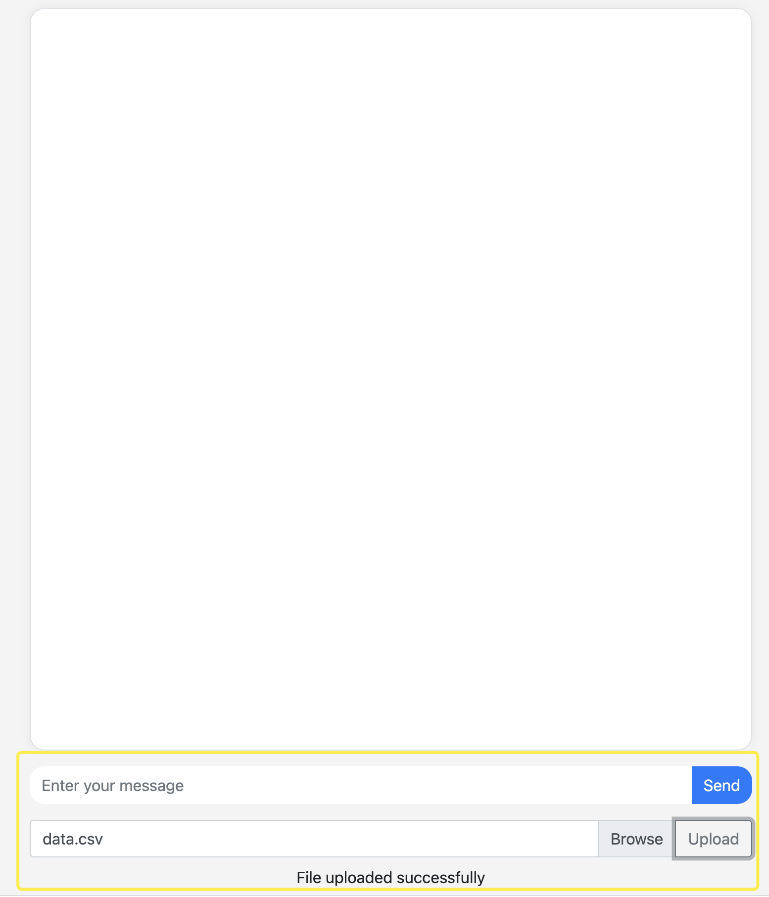
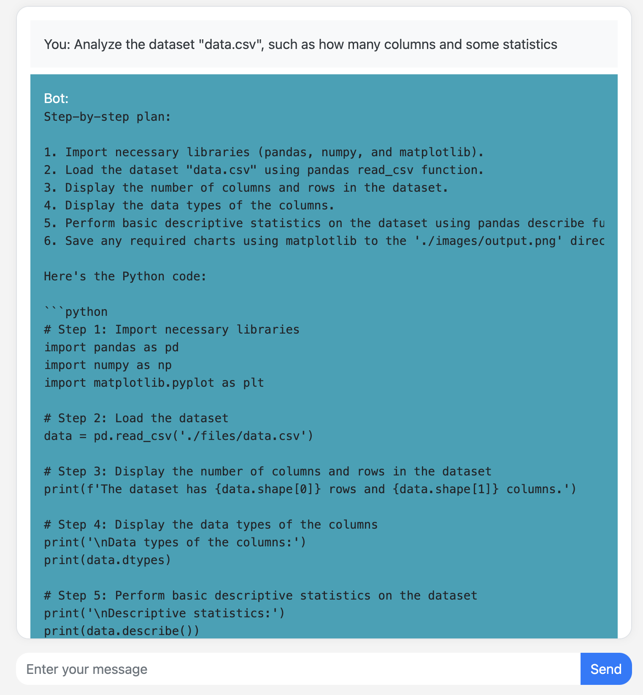
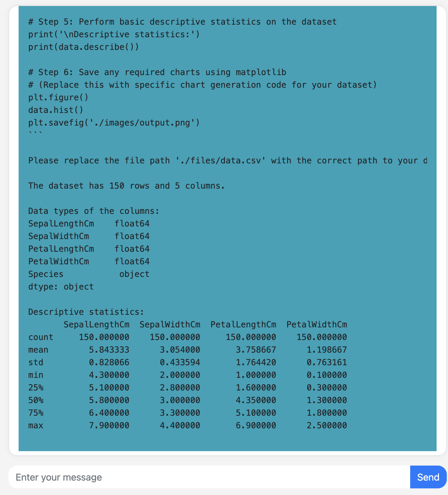
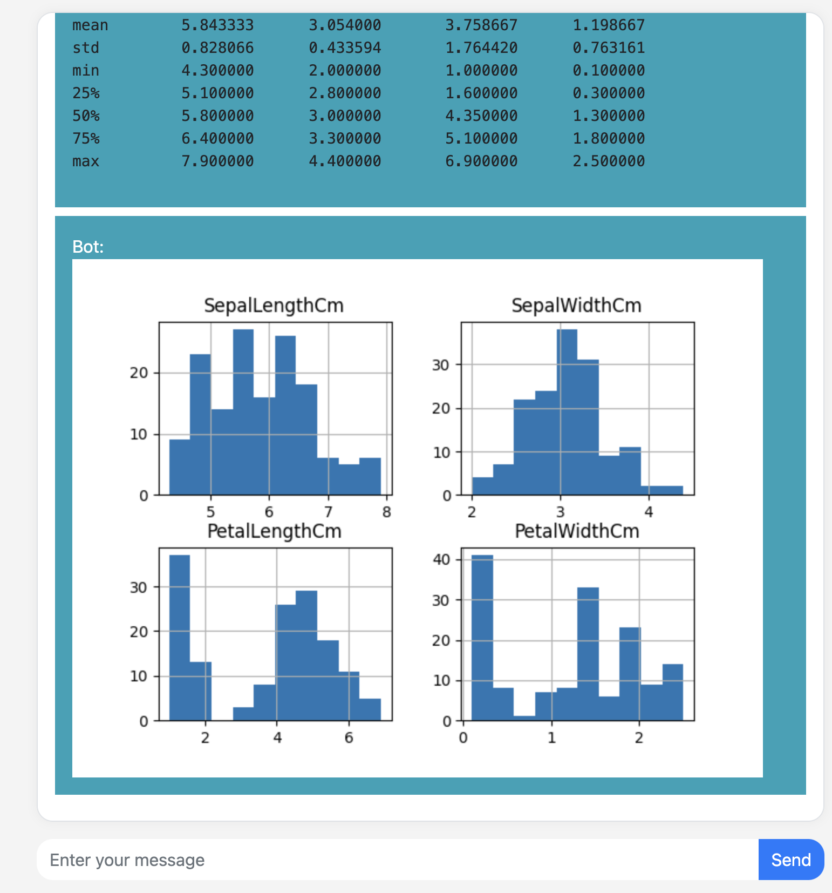

# Toy Code Interpreter

## Project Description

The Toy Code Interpreter serves as a simplified replica of OpenAI's ChatGPT Code Interpreter. Designed to unravel the complexities of the ChatGPT Code Interpreter, this project sheds light on the intricate processes involved in prompt formulation, code generation and execution, as well as the presentation of final results. 


## Workflow

```text
Upload Dataset
       |
       V
Ask ChatGPT Questions
       |
       V
Extract Necessary Code
       |
       V
Execute Code in InteractiveShell
       |
       V
Display Results
```


## Installation / Usage

1. Clone the project to your local machine

2. Navigate into the project directory

3. Config the Azure API or OPENAI_API_KEY in the get_code.py

4. Launch the Web UI

```text
python main.py
```

5. Open your web browser and navigate to the following URL

```text
http://127.0.0.1:5000/
```

6. Use the web UI to upload your dataset



7. Input your question into the provided field and send. The system will generate an answer for you.



8. After executing the generated code, the system will display additional text information related to your query.



9. The system also provides visualized data in the form of plots related to your query.



## References

This project was inspired by and references the following projects:
- gpt-code-ui: https://github.com/ricklamers/gpt-code-ui

## Limitation

Please note, we have substantially simplified the implementation of this project, keeping it less code-intensive for the benefit of beginners. However, it's important to understand that this approach has certain limitations when compared to the built-in code interpreter of ChatGPT, and thus, it isn't suitable for conducting complex analyses.

## Contributing
Contributions of any kind are welcome, including but not limited to submitting issues, suggesting improvements, or directly submitting code.

## License
MIT

## Contact
If you have any questions or suggestions, feel free to contact me via email: (474340367@qq.com).